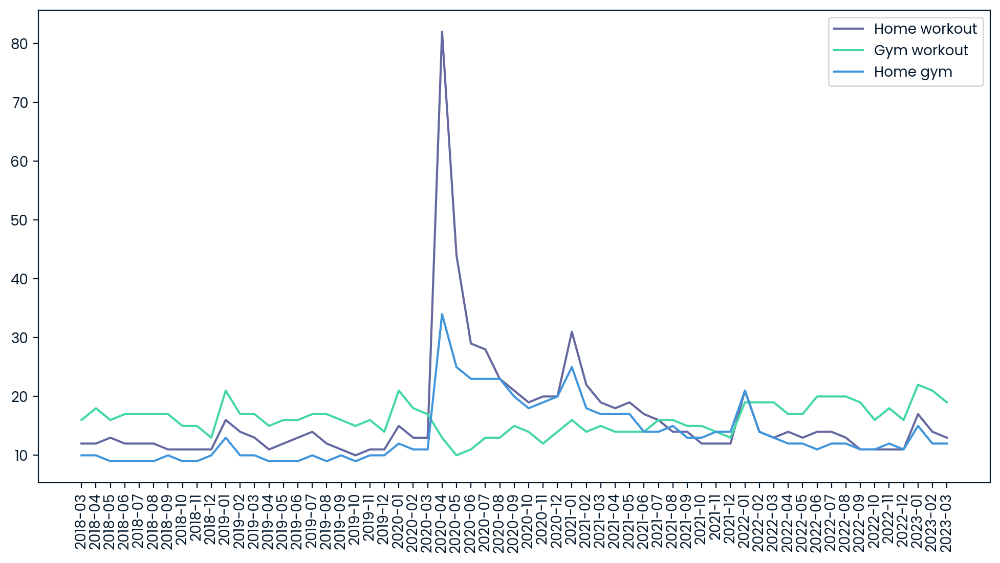

# Data-Driven Product Management: Market Analysis for App Development
**Technical Research Case Study | Python Business Intelligence**

## 📌 Project Overview
This research analyzed the mobile app market using a dataset of over 9,000 apps to identify profitable niches for new product development. The project focuses on uncovering the relationship between **Category**, **Rating**, **Pricing**, and **Installs** to provide data-driven recommendations that minimize risk and maximize user acquisition for a product management team.

---

## 🛠️ Technical Toolkit
* **Language:** Python
* **Libraries:** Pandas (Data Cleaning & Wrangling), Seaborn & Matplotlib (Market Visualization)
* **Techniques:** Data Sanitization, Type Conversion, Category Aggregation, Outlier Analysis.

---

## Research Methodology
A multi-stage data pipeline was implemented to transform raw, "dirty" market data into actionable insights:

1.  **Data Sanitization & Cleaning:** I addressed data integrity issues in the `Installs` and `Price` columns by stripping non-numeric characters (e.g., `+`, `,`, `$`).
2.  **Type Conversion:** Converted cleaned strings into numeric types (float/int) to enable mathematical modeling and statistical calculations.
3.  **Market Segmentation:** Grouped over 30 categories to visualize market distribution and saturation levels.
4.  **Sentiment Mapping:** Evaluated average user ratings across categories to identify sectors where users are consistently underserved or dissatisfied.

---

## Key Insights & Market Outcomes
* **Niche Opportunity:** Specific categories like **HEALTH_AND_FITNESS** showed a strong balance of high user installs and high sentiment (ratings), representing a prime "Market-Product Fit."
* **Monetization Strategy:** The analysis confirmed that the vast majority of successful market leaders follow a **Freemium model**, suggesting that a "Free-to-Install" entry point is essential for rapid scaling.
* **Rating Benchmarks:** Established that a new product must target a minimum rating of **4.3** to be competitive, as the majority of high-performing apps cluster between 4.0 and 4.5.

### Market Distribution Visualization

*Figure 1: Distribution of apps across various market categories, highlighting the volume of competition in each sector.*

### Rating vs. Pricing Insights

*Figure 2: Scatter plot analysis showing the relationship between app pricing and user sentiment.*

---

## Technical Implementation
The core of this project involved programmatic data cleaning using Python's `apply` and `lambda` functions to prepare the dataset for statistical analysis.

```python
import pandas as pd
import matplotlib.pyplot as plt

# Ensure the correct path to the CSV file is provided
# Load workout.csv
workout = pd.read_csv("data/workout.csv")
print(workout.head())

# Load workout_geo.csv
workout_geo = pd.read_csv("data/workout_geo.csv")
print(workout_geo.head())

# Ensure the correct path to the CSV file is provided
# Load workout.csv
workout = pd.read_csv("data/workout.csv")
# print(workout.head())

# Load workout_geo.csv
workout_geo = pd.read_csv("data/workout_geo.csv")
# print(workout_geo.head())

# Check the columns of workout_geo to find the correct column name
print(workout_geo.columns)

# Assuming the correct column name is 'workout_years' based on the column names
year_str = workout_geo[workout_geo['workout_2018_2023'] != 'NaN'].agg({'workout_2018_2023': 'mode'})
print(year_str.head())

# Find the peak for global 'workout' searches
df_workout = pd.read_csv("data/workout.csv")

plt.figure(figsize=(12, 6))
plt.plot(df_workout["month"], df_workout["workout_worldwide"])
plt.xticks(rotation=90)
plt.show()

year_str = "2020"

# Find the most popular keywords for the current year and during covid
df_keywords = pd.read_csv("data/three_keywords.csv")

plt.figure(figsize=(12, 6))
plt.plot(df_keywords["month"], df_keywords["home_workout_worldwide"], label="Home workout")
plt.plot(df_keywords["month"], df_keywords["gym_workout_worldwide"], label="Gym workout")
plt.plot(df_keywords["month"], df_keywords["home_gym_worldwide"], label="Home gym")
plt.xticks(rotation=90)
plt.legend()
plt.show()

peak_covid = "home workout"
current = "gym workout"

# Find the country with the highest interest for workouts
df_workout_geo = pd.read_csv("data/workout_geo.csv", index_col = 0)
print(df_workout_geo.loc["United States"])
print(df_workout_geo.loc["Australia"])
print(df_workout_geo.loc["Japan"])

top_country = "United States"

# Who has the highest interest in home workouts, Philippines or Malaysia?
df_keywords_geo = pd.read_csv("data/three_keywords_geo.csv", index_col = 0)
print(df_keywords_geo.loc["Philippines", :])
print(df_keywords_geo.loc["Malaysia", :])

home_workout_geo = "Philippines"
```
***Note:*** *This project demonstrates the application of Industrial Mathematics logic—precision and algorithmic structure—to solve modern business problems.*
## 📁 Repository Structure
```text
├── notebook.ipynb    
├── data/
│   └── three_keywords_geo.csv              
│   └── three_keywords.csv  
│   └── workout_geo.csv  
│   └── workout.csv  
└── README.md
```

## 📫 Connect with me:
* **LinkedIn:** [linkedin.com/in/emycodes](https://linkedin.com/in/emycodes)