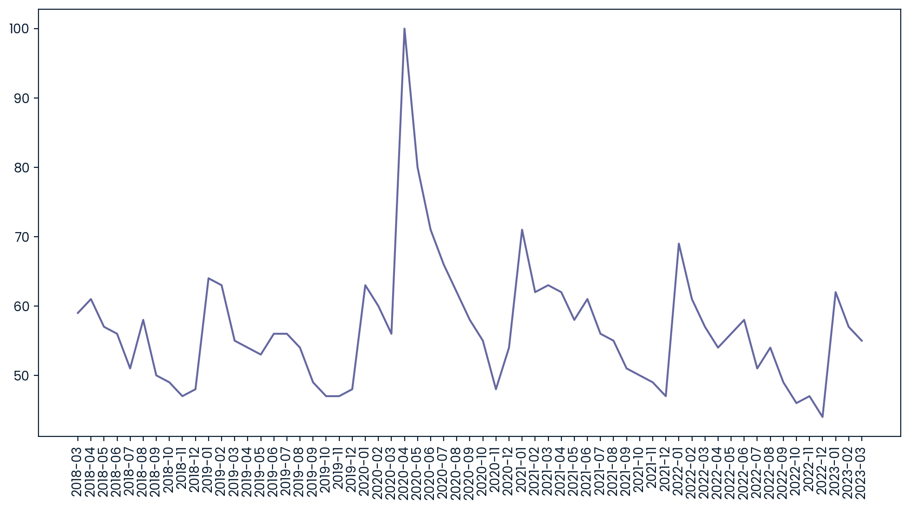

# Data Analytics Portfolio
### Hi, I'm EmyCodes 👋 

I am an **Industrial Mathematics** graduate specializing in Data Analytics and Process Automation. My work focuses on building efficient data pipelines and extracting technical insights from complex datasets to drive strategic growth.

---

## 🛠️ Technical Toolkit
* **Data Analysis:** Python (Pandas, NumPy), SQL (PostgreSQL/MySQL), Microsoft Excel (Advanced Functions & VBA)
* **Visualization:** Matplotlib, Seaborn, Excel Dashboards, Power BI (Coming soon)
* **Technical Workflow:** Time-Series Analysis, ETL Pipelines, Market Research, Exploratory Data Analysis (EDA), Process Automation

---

## 📁 Featured Projects

### 🏋️‍♂️ [Global Fitness Market Analysis](Fitness-Trends-Analysis/)
**Tools:** Python (Pandas, Matplotlib)
* Analyzed global search trends (2018–2023) to identify shifts in the fitness industry.
* **Technical Achievement:** Performed multi-dataset merging and time-series segmentation to isolate the 2020 "Home Workout" surge and the current "Gym Workout" resurgence.
* **Finding:** Identified the **United States** and **Philippines** as high-growth regions for specific fitness equipment niches.

### 📊 [WordAlive Tracker Testing](WordAlive-Engagement-Automation/)
**Tools:** Excel, Google Forms, Excel Tables
* Automated a manual tracking system for a 100+ member community to eliminate data entry bottlenecks.
* **Technical Achievement:** Built a digital pipeline transforming raw Google Form inputs into real-time analytical dashboards.
* **Metric:** Segmented users by 50% and 60% submission rates to provide technical data for targeted retention strategies.

### 🎬 [Streaming Trends Analysis](Streaming-Trends-Analysis/)
**Tools:** Python (Pandas, Seaborn)
* Executed an Exploratory Data Analysis (EDA) on a dataset of 4,800+ titles to uncover entertainment industry patterns.
* **Technical Achievement:** Utilized boolean indexing and temporal segmentation to isolate 1990s content and identify outliers in genre distribution.
* **Finding:** Quantified the most frequent movie duration of the 1990s as **94 minutes**, establishing a technical benchmark for content pacing.

---

## 🖼️ Project Gallery
| Community Automation | Fitness Trend Analysis | Streaming Trends |
| :---: | :---: | :---: |
|  |  |  |
| *Excel Engagement Dashboard* | *2020 Search Peak Visualization* | *Final Year Project Visualization* |

---

## 📈 My "Practice to Perfection" Journey
I am a **3MTT Fellow** and **ForbesBLK Member** dedicated to technical excellence in Data Analytics. I focus on "learning in public" by documenting technical workflows, data integrity processes, and automation logic.

I believe that a Data Analyst's greatest tool is the ability to present findings without bias. While I am constantly learning and refining my skills, I am committed to "learning in public." You can find my recent lessons on data integrity and process automation documented here and on my LinkedIn.

---

## 📫 Connect with me:
* **LinkedIn:** [linkedin.com/in/emycodes](https://linkedin.com/in/emycodes)
* **Role Interests:** Data Analyst, Business Intelligence Analyst, Product Analyst, Operations Research.

---
*"Data is most powerful when it serves as a clear, honest bridge between raw numbers and strategic growth."*
