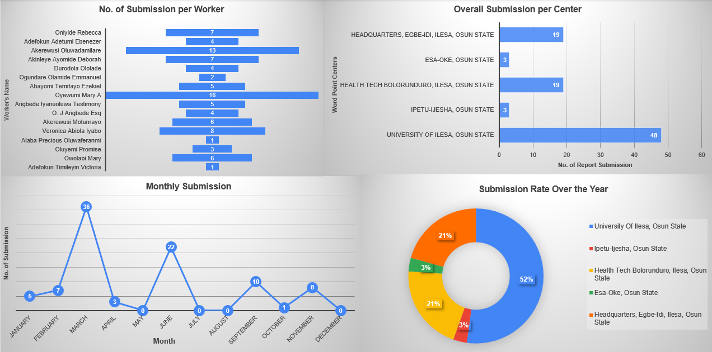

# 📊 WordPoint Ministries: Digitized Workers Report (DWR) & Engagement Dashboard

## 📌 Project Overview
The Evolution of Impact: From Building Pipelines to Visualizing Insights.

This project represents a full-cycle data solution—transitioning from a manual monitoring system developed during my Industrial Training (IT) to a modern, visual analytical dashboard. By revisiting a dataset of **92 responses** from **16 individuals** across **5 centers** in Osun State, I transformed "raw noise" from my original DWR system into a strategic roadmap for leadership.

## 🚀 The Journey: From IT to Data Viz
During my industrial training, I pivoted from theoretical mathematics to practical data solutions by developing the **Digitized Workers Report (DWR)** system. What began as a journey from manual tracking to a digital ecosystem has now evolved. Fresh from completing the *Data Visualization with Excel and Cognos* course, I revisited this dataset to see what stories the numbers were truly telling.

## 🛠️ Technical Stack
* **Data Collection:** Google Forms & Automated Google Sheets Pipeline.
* **Data Cleaning:** Excel (Validation, deduplication, and normalization).
* **Visualization:** Microsoft Excel (Integrated Dashboard using Funnel, Column, Line, and Pie Charts).
* **Methodology:** ETL (Extract, Transform, Load) and Descriptive Analytics.

## 🔐 Data Governance & Security
* **Information Masking:** Sensitive worker identifiers have been hidden to ensure privacy while maintaining the integrity of center-based analytics.
* **Workbook Protection:** All source sheets and the global workbook are password-protected to mimic enterprise-level data administrative security.

## 📈 Strategic Insights Uncovered
* **Engagement Hotspots:** The **University of Ilesa** leads with the highest engagement (**48 submissions**), followed by the **Headquarters** at 19.
* **Targeted Intervention:** Identified centers with the lowest submission rates, such as **OSCOTECH Esa-Oke** and **UNIOSUN Ipetu-Ijesa**, providing a roadmap for leadership encouragement.
* **Individual Consistency:** The data isolated specific "signals" for follow-up, such as identifying active vs. inactive respondents through submission frequency.

## 🖼️ Dashboard Preview
The dashboard integrates multiple visual narratives (Funnel, Column, Line, and Pie charts) into a single interactive view to track engagement metrics across Osun State.

*Full Integrated Engagement Dashboard*

## 🔮 Future Roadmap
This is just the beginning. My next step is to run this same validated dataset through **IBM Cognos** and **Google Looker** to compare how different enterprise tools handle the same narrative.

---
*"It’s one thing to collect data, but it’s another to make it speak."* 

©️ **EmyCodes | 2026**