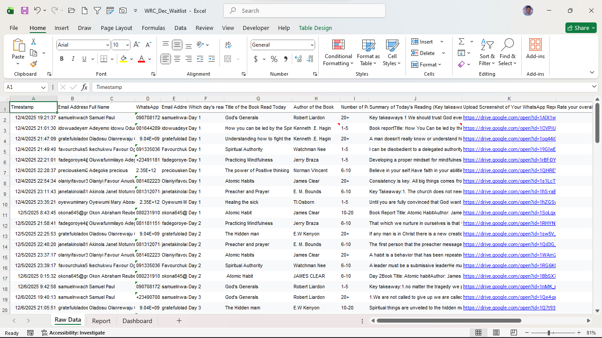
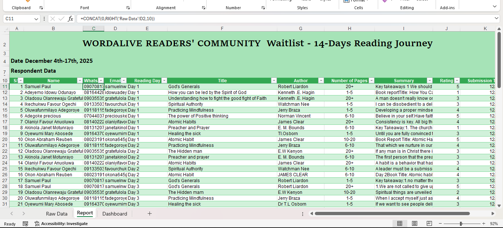
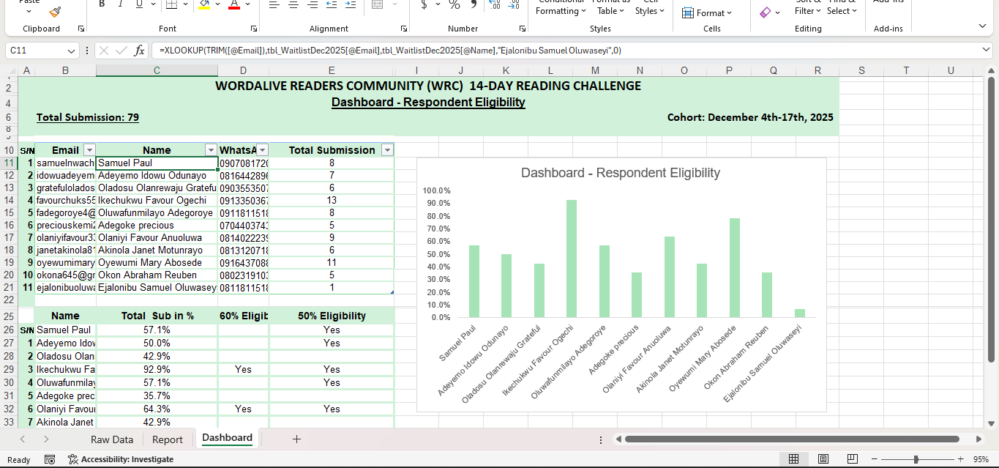

# 📚 WordAlive Community Engagement Automation
**Organization:** WordAlive Readers’ Community  
**Role:** Volunteer Data Analyst  
**Project Type:** Data Pipeline & Workflow Automation  

## 📌 Project Overview
The **WordAlive Readers’ Community** is a growth-oriented group that inspires intentional daily reading across diverse subjects such as **Finance, Business, Relationships, and Spiritual Growth**. 

This project involved transforming a manual, decentralized member-tracking process into a streamlined digital ecosystem. By applying mathematical logic and Excel automation, I eliminated administrative bottlenecks and provided leadership with real-time visibility into member progress.

---

## 🛠️ The "Raw to Insight" Workflow
I architected the data lifecycle using a three-stage approach to ensure data integrity and actionable results.

### 1. Data Acquisition (Raw Data)
I established **Excel Queries** to link live submission data from Google Forms directly into a master Excel workbook. This created a "single source of truth" and eliminated manual data entry errors.

### 2. Logic & Transformation (Cleaned Data)
Using my background in **Industrial Mathematics**, I built a calculation engine to process raw inputs without external software.
* **Logical Structuring:** Used nested `IF` and `IFS` functions to categorize member status based on submission frequency.
* **Data Mapping:** Leveraged `XLOOKUP` and `VLOOKUP` to integrate member profiles with their daily reports.
* **Aggregation:** Applied `COUNTIFS` and `SUMIFS` to calculate individual and group engagement percentages.

### 3. Visualization & Reporting (The Dashboard)
The final output is an interactive dashboard that translates numbers into a visual narrative.
* **Key Insight Segmentation:** I specifically designed the dashboard to highlight members hitting **50% and 60% submission rates**. This allows leadership to identify "at-risk" members or those needing a final push toward total consistency.
* **Tools:** Excel Tables and Charts.

---

## 📈 Impact & Business Value
* **100% Automation:** Removed the need for manual group marking, saving several hours of administrative work weekly.
* **Reporting Speed:** Reduced data-to-insight latency from 48 hours to **instant** upon data refresh.
* **Decision Support:** Enabled leadership to track growth trends across all reading categories (e.g., Finance vs. Spiritual) at a glance.

---

### 📸 Project Gallery

### 1. The Raw Data Pipeline

*Connecting live Google Forms data to Excel via Queries to establish a single source of truth.*

### 2. Data Cleaning & Transformation (The Logic)

*Applying Industrial Math logic through nested IF functions, XLOOKUPs, and data standardization to turn raw noise into structured metrics.*

### 3. The Final Dashboard

*Interactive visual narrative highlighting the 50% and 60% submission segments for leadership decision-making.*

---
*This project is part of my "Practice to Perfection" journey. I am currently expanding this portfolio to include SQL and Python projects.*

**Connect with me:** [LinkedIn](https://linkedIn.com/in/emycodes)

---

©️ **EmyCodes | 2026**